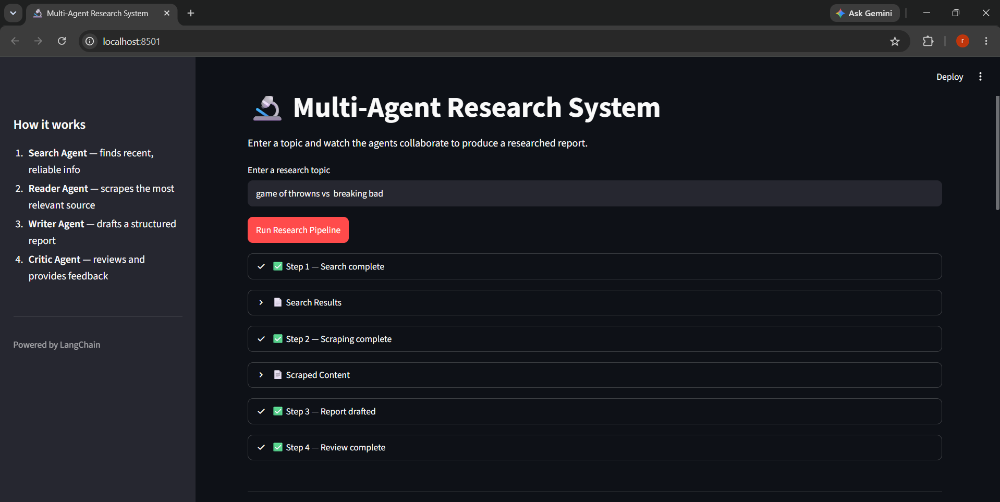
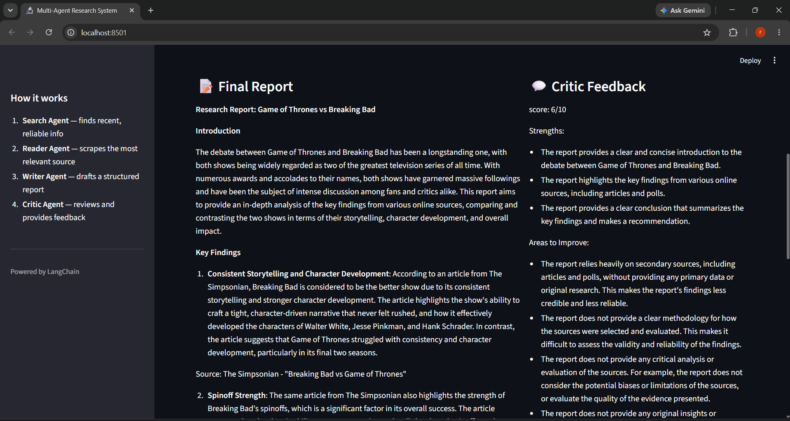
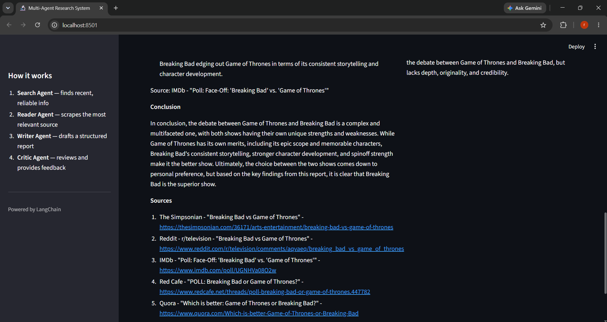

# Multi-Agent Research System

A Streamlit application that coordinates specialised AI roles to turn a research topic into a structured report and a separate quality review. It uses LangChain agents, Groq's `llama-3.1-8b-instant` model, Tavily web search, and Beautiful Soup page extraction.

## What it does

Enter a topic in the browser and run a four-stage research workflow:

1. **Search Agent** finds up to five recent web results through Tavily.
2. **Reader Agent** selects a relevant URL and uses the scraping tool to obtain page text.
3. **Writer** combines search material and scraped context into a report with an introduction, key findings, conclusion, and sources.
4. **Critic** independently scores the draft and returns strengths, areas to improve, and a verdict.

The interface shows stage completion, makes search and scraping output inspectable, and displays the report alongside the critic feedback.

## Architecture

```mermaid
flowchart LR
    U[User enters a topic\nin Streamlit] --> S[Search Agent]
    S -->|web_search tool| T[Tavily Search API]
    T --> R[Search result text]
    R --> A[Reader Agent]
    A -->|scrape_url tool| W[Selected web page]
    W --> C[Cleaned page text\nmax 3,000 characters]
    R --> D[Writer Chain]
    C --> D
    D --> E[Structured research report]
    E --> F[Critic Chain]
    F --> G[Score, strengths, improvements, verdict]
    E --> UI[Streamlit results view]
    G --> UI
```



### Runtime flow

```text
topic
  └─ Search Agent ──► search_results
                        └─ Reader Agent ──► scraped_content
search_results + scraped_content ──► Writer Chain ──► report
report ──► Critic Chain ──► feedback
report + feedback ──► Streamlit UI
```

## Design strategy

The system separates responsibilities rather than asking one prompt to do everything:

| Component | Responsibility | Design value |
| --- | --- | --- |
| Search Agent | Discovers candidate sources | Keeps live information retrieval tool-based and traceable. |
| Reader Agent | Chooses and reads a source | Adds deeper source context instead of relying only on snippets. |
| Writer Chain | Produces a consistent report format | A fixed prompt makes output predictable and easy to present. |
| Critic Chain | Evaluates the generated report | Creates a separate feedback loop and exposes quality limitations. |
| Streamlit UI | Orchestrates the same stages visually | Makes work-in-progress and intermediate evidence visible to the user. |

`agents.py` centralises model setup and prompts, `tools.py` isolates external retrieval, and `pipeline.py` provides a command-line orchestration path. `app.py` implements the same sequence for Streamlit so the UI can show each stage as it completes.

## Project structure

```text
Multi_Agent_System/
├── app.py              # Streamlit interface and UI orchestration
├── agents.py           # Search/reader agents plus writer and critic chains
├── tools.py             # Tavily search and URL scraping tools
├── pipeline.py          # Command-line research pipeline
├── test.py              # Small manual search-tool smoke test
├── requirements.txt     # Python dependencies
└── Assets/              # Example tool and Streamlit output captures
```

## Sample Streamlit output

The app first reports completion of each of the four stages and exposes expandable search and scraped-content panels.



It then presents the generated research report and an independent critic review side by side.



An example run includes cited sources at the end of the report.



## Requirements

- Python 3.10 or later
- A Groq API key
- A Tavily API key

Install the dependencies:

```bash
pip install -r requirements.txt
```

Create a `.env` file in the project root:

```env
GROQ_API_KEY=your_groq_api_key
TAVILY_API_KEY=your_tavily_api_key
```

The `.env` file is ignored by Git and should never be committed.

## Run the application

Start the Streamlit interface:

```bash
streamlit run app.py
```

Or run the terminal version:

```bash
python pipeline.py
```

The terminal workflow asks for a topic and prints search output, scraped material, the generated report, and critic feedback.

## Current implementation notes

- The search tool asks Tavily for a maximum of five results and formats each with title, URL, and a 300-character snippet.
- The reader receives the first 800 characters of that search output and decides which result to scrape.
- Page extraction removes `script`, `style`, `nav`, and `footer` elements, has an 8-second timeout, and returns at most 3,000 characters.
- The application runs stages synchronously. A request must complete before the next stage starts.
- There is no database, user authentication, caching, or report history; results live only for the active run.

## Limitations and recommended next steps

This is a sound prototype, but a production-quality research assistant would benefit from the following:

1. **Use multiple sources.** The writer currently gets a single deep scrape, so it can over-weight one page. Scrape and compare several high-quality sources.
2. **Preserve structured evidence.** Pass source URLs, titles, snippets, and extracted text as structured data rather than parsing messages by class name or using only the final reader message.
3. **Validate citations.** Require each factual finding to link to a retrieved source and reject unsupported claims.
4. **Add resilient retrieval.** Handle blocked pages, non-HTML pages, rate limits, retries, and content-quality checks explicitly.
5. **Improve observability.** Replace `print` statements with logging and show useful errors in Streamlit.
6. **Avoid duplicated orchestration.** Extract the shared four-stage workflow from `pipeline.py` and `app.py` into one reusable function.
7. **Add automated tests.** Mock Tavily, scraping, and model responses to test tool formatting, state construction, and UI-facing outputs deterministically.

## Technology stack

- [Streamlit](https://streamlit.io/) for the web interface
- [LangChain](https://www.langchain.com/) for agents, prompts, tools, and chains
- [Groq](https://groq.com/) for LLM inference
- [Tavily](https://tavily.com/) for web search
- [Requests](https://requests.readthedocs.io/) and [Beautiful Soup](https://www.crummy.com/software/BeautifulSoup/) for retrieval and HTML text extraction
